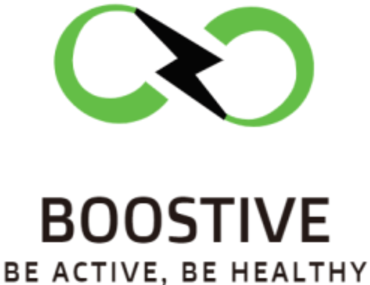
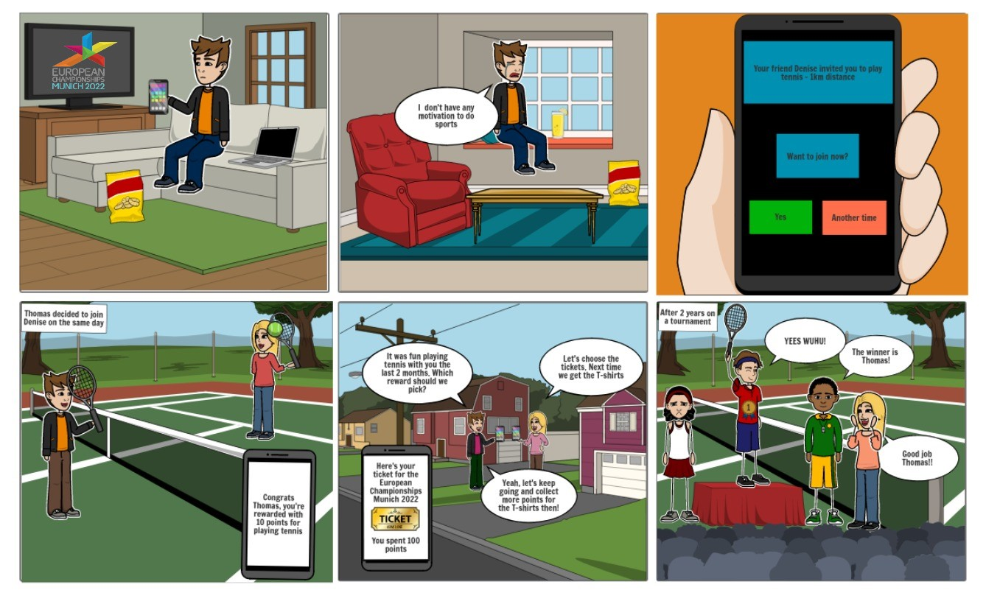
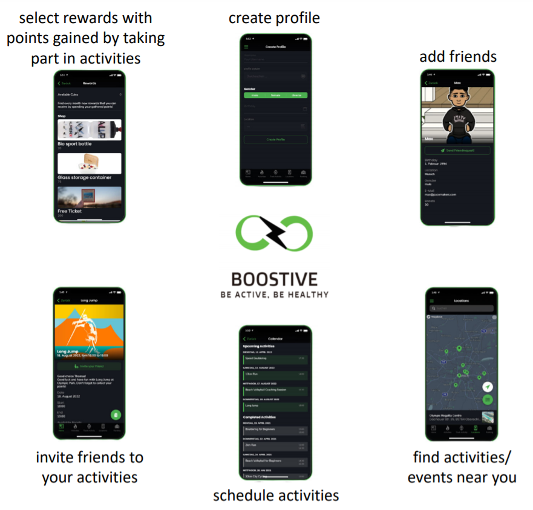
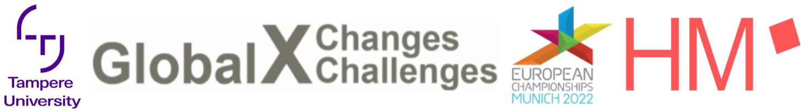

# About Boostive 

Welcome to the repository of Boostive, the hybrid mobile app that motivates especially digital natives to live a more active and healthy lifestyle. We are a young **value driven start-up** that was founded after participating in the [GXC International Virtual Innovation Challenge](https://www.hm.edu/en/international/projects_1/gxc/gxc_virtual_innovation_challenge.en.htm). 

The **goal of the challenge** provided by the multi-sport event [European Championships Munich 2022](https://gxc-int-innovation-challenge21.github.io/gxc-team-21/) has been to motivate their visitors and spectators to do more sports and inspire them to lead a more active lifestyles, creating a positive impact for local sport clubs and society as a whole.

After aligning our team, we started with a deep research on environmental/sustainability issues of sport events, reasons why people join local sports clubs, motivation of visitors and numerous of interviews with potential visitors/spectators we created the following **storyboard** for our product.

## Storyboard

Please find further explanation to each step of the storyboard [here](https://github.com/gxc-int-innovation-challenge21/gxc-team-21/wiki/Storyboard).

# Boostive - Connect to sport events and local sport clubs

Boostive is going to motivate the users by providing different activities and try out stages for different sports at sport events or local sports clubs. Moreover, users will be motivated by gamification through comparison of their statistics with other users. Additionally, Boostive provides the unique opportunity to gather coins while taking part in official activities provided by sport events. By redeeming those coins, sports products and sustainable items can be bought in the reward shop.

**All those features will boost all users to be more active and connect to new sport communities.**

Please use the QR-Code or [this link](https://boostive.glideapp.io/) to test the boostive protoype, but make sure to check the full explanation on [how to use the protoype](https://github.com/gxc-int-innovation-challenge21/gxc-team-21/wiki/Prototyping-a-Solution#Interactive-prototype-and-Instructions).

### [Boostive Wiki](https://github.com/gxc-int-innovation-challenge21/gxc-team-21/wiki)

### [Boostive GitHub pages](https://gxc-int-innovation-challenge21.github.io/gxc-team-21/)

